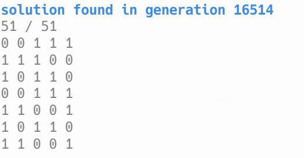

## <center>人工智能基础    实验一</center>

<center>甘文迪    PB19030801</center>

### 1.1

#### 算法思想

A* 算法使用到达结点的代价 g(n) 和从该结点到目标结点的最小代价的估计值 h(n) 来评估结点，可以找到问题的最优解。

从起点出发，访问每个结点，并计算该结点的 g(n) 和 h(n)，加入优先队列。每次取出优先队列中的 $f(n)+g(n)$ 最小的结点

其中 h(x) 要满足可采纳性，不能高估到达目标结点的代价

IDA* 使用 $f(n)+g(n)<=nextDLimit$ 对深度优先搜索进行剪枝，以尽快找到最优解。

##### h(x) 的选择

h1(x) 表示错位的星球数

h2(x) 定义为所有星球与其目标位置的距离之和，其中两位置的距离指其横纵坐标的 dist 的和，而 $dist(x_1, x_2)=\min\{|x_1-x_2|,|5-x_1+x_2|,|5-x_2+x_1|\}$

假设四面墙都可以用 1 的代价到达对面，则 x1 与 x2 的距离为 $dist(x_1, x_2)$，(x1, y1) 与 (x2, y2) 的距离是 $dist(x_1, x_2)+dist(y_1, y_2)$

每移动 1 步最多让一个星球移动 1 格，最多使这个星球与目标位置的距离减少 1，最多使 h 减少 1

因此 h2 没有高估，h2 可采纳

#### 样例运行结果

> 编译选项：`-O3 -march=native`

##### A_h1

| 样例编号 | 运行时间     | 移动序列                             | 总步数 |
|:----:|:--------:|:--------------------------------:|:---:|
| 0    | 4.3e-05  | DDRUR                            | 5   |
| 1    | 3.8e-05  | ULLUULDD                         | 8   |
| 2    | 5e-05    | DDLUULLURR                       | 10  |
| 3    | 0.000159 | DLDRRURRRUUURR                   | 14  |
| 4    | 0.001131 | LUUURULLURDDRDR                  | 15  |
| 5    | 0.005941 | LLUURRRUURDDDDLUURDD             | 20  |
| 6    | 0.004237 | DRDLLULULUUURDRURDRDRRR          | 23  |
| 7    | 0.000435 | URRRRDLLLLDRRRRDLLLLDRRRR        | 25  |
| 8    | 0.185107 | DDRULLLLDRUUUULDRRRRULDDDDR      | 27  |
| 9    | 5.06157  | RDRDLUUUURRDRDDRUUULLDRULURR     | 28  |
| 10   | 0.449709 | DDRRUUUULLULLUULLLLLUURRDDDDRR   | 30  |
| 11   | 25.2183  | DRUURDRRDRUULDLULDLDRDLDRURDRURD | 32  |

##### A_h2

| 样例编号 | 运行时间     | 移动序列                             | 总步数 |
|:----:|:--------:|:--------------------------------:|:---:|
| 0    | 4.6e-05  | DDRUR                            | 5   |
| 1    | 3.8e-05  | ULLUULDD                         | 8   |
| 2    | 3.2e-05  | DDLUULLURR                       | 10  |
| 3    | 6.8e-05  | DLDRRURRRUUURR                   | 14  |
| 4    | 7.4e-05  | LUUURULLURDDRDR                  | 15  |
| 5    | 6.9e-05  | LLUURRRUURDDDDLUURDD             | 20  |
| 6    | 0.000828 | DRDLLULULUUURDRURDRDRRR          | 23  |
| 7    | 0.000149 | URRRRDLLLLDRRRRDLLLLDRRRR        | 25  |
| 8    | 0.000458 | DRDLULLLDRUUUULDRRRRULDDDRD      | 27  |
| 9    | 0.074146 | RRRRDRUUULDLDLLDRDLUUUURRURR     | 28  |
| 10   | 0.000186 | DDRRUUUULLULLUULLLLLUURRDDDDRR   | 30  |
| 11   | 0.149748 | DRUURDRRDRUULDLULDLDRDLDRURDRURD | 32  |

##### IDA_h1

| 样例编号 | 运行时间     | 移动序列                             | 总步数 |
|:----:|:--------:|:--------------------------------:|:---:|
| 0    | 3.1e-05  | DDRUR                            | 5   |
| 1    | 5.3e-05  | ULLUULDD                         | 8   |
| 2    | 2.7e-05  | DDLUULLURR                       | 10  |
| 3    | 0.000126 | DLDRRURRRUUURR                   | 14  |
| 4    | 0.001468 | LUUURULLURDDRDR                  | 15  |
| 5    | 0.003163 | LLUURRRUURDDDDLUURDD             | 20  |
| 6    | 0.003786 | DRDLLULULUUURDRURDRDRRR          | 23  |
| 7    | 0.000359 | URRRRDLLLLDRRRRDLLLLDRRRR        | 25  |
| 8    | 0.117206 | DRDLULLLDRUUUULDRRRRULDDDRD      | 27  |
| 9    | 1.82239  | RRRRDRUUULDLDLLDRDLUUUURRURR     | 28  |
| 10   | 0.356295 | DDRRUUUULLULLUULLLLLUURRDDDDRR   | 30  |
| 11   | 22.6087  | DRUURDRRDRUULDLULDLDRDLDRURDRURD | 32  |

##### IDA_h2

| 样例编号 | 运行时间     | 移动序列                             | 总步数 |
|:----:|:--------:|:--------------------------------:|:---:|
| 0    | 3.1e-05  | DDRUR                            | 5   |
| 1    | 6.4e-05  | ULLUULDD                         | 8   |
| 2    | 6.1e-05  | DDLUULLURR                       | 10  |
| 3    | 9.1e-05  | DLDRRURRRUUURR                   | 14  |
| 4    | 8.9e-05  | LUUURULLURDDRDR                  | 15  |
| 5    | 9.3e-05  | LLUURRRUURDDDDLUURDD             | 20  |
| 6    | 0.000258 | DRDLLULULUUURDRURDRDRRR          | 23  |
| 7    | 0.000101 | URRRRDLLLLDRRRRDLLLLDRRRR        | 25  |
| 8    | 9.6e-05  | DRDLULLLDRUUUULDRRRRULDDDRD      | 27  |
| 9    | 0.024246 | RRRRDRUUULDLDLLDRDLUUUURRURR     | 28  |
| 10   | 0.000134 | DDRRUUUULLULLUULLLLLUURRDDDDRR   | 30  |
| 11   | 0.022376 | DRUURDRRDRUULDLULDLDRDLDRURDRURD | 32  |

#### 优化方法

如果不记录飞船位置，则在每次根据当前状态生成下一步状态时（`genNextStates`）都需要进行两重 `for` 循环

在 State 中添加状态即可，对于最后一个样例， `A_h1 ` 的用时略有减少（不到 1 秒）

对于启发函数 `h1`，可以根据 prev 的状态和启发函数值计算 new 的启发函数值（只需判断两个元素）。但结果是比两重 `for` 循环（25 次）慢，这可能和访存有关。优化失败

> 优化更多地体现在一些细节上，比如使用引用传递参数，避免在函数调用时复制对象

### 1.2

#### 描述变量集合、值域集合、约束集合

假设有 n 个工人

+ 变量集合：$7 n$ 个变量 $x_{i,j}$，代表第 i 个工人第 j 天是否工作

+ 值域集合：每个变量的值域均为 $\{0,1\}$，1 表示工作，0 表示不工作

+ 约束集合：
  
  根据每条，可以写出对应的
  
  + 每天至少要有一名级别为 senior 的工人值班（每天级别为 senior 的工人数的状态之和大于等于 1）
  + 工人 i 不想和工人 j 一起工作（每天工人 i, j 的状态之和小于等于 1）
  
  | 需求                       | 约束                           | 公式                                                                  |
  |:------------------------:|:----------------------------:|:-------------------------------------------------------------------:|
  | 每天至少要有 everydayNeed 个人值班 | 每天工人状态数之和大于等于 everydayNeed   | $\sum_\limits{i=1}^{n} x_{i,j}\geq everydayNeed,\ 1\leq j\leq 7$    |
  | 每个工人每周必须休息 2 天或 2 天以上    | 每个工人工作日状态之和小于等于 5            | $\sum_\limits{j=1}^{7} x_{i,j}\leq 5, \ 1\leq i\leq n$              |
  | 每个工人每周不可以连续休息 3 天        | 每个工人连续三天的状态之和大于 0            | $\sum_\limits{k=j}^{j+2} x_{i,j}>0, \ 1\leq i\leq n, 1\leq j\leq 5$ |
  | 每天至少要有一名级别为 senior 的工人值班 | 每天级别为 senior 的工人数的状态之和大于等于 1 | $\sum_\limits{x_i\ is\ senior} x_{i,j} \geq 1, \ 1\leq j\leq 7$     |
  | 工人 x 不想和工人 y 一起工作        | 每天工人 x, y 的状态之和小于等于 1        | $x_{x,j}+x_{y,j} \leq 1,\ 1\leq j\leq 7$                            |

#### 算法的主要思路

深度优先搜索

```c++
void Solver::simpleVisit(int unknownIndex) {
    // 设置未知数的属性
    auto unknown = unknowns[unknownIndex];
    unknown->determined = true;

    for (int value = 1; value >= 0; value--) {
        unknown->value = value;

        // 判断各个约束是否满足
        for (auto& expression : unknown->appeared)
            if (expression->undeterminedCount == 0)
                expression->evaluate();

        if (!correct)
            continue;

        // 如果满足，且全部访问完毕，则记录结果，否则访问下一个
        if (unknownIndex + 1 == unknownNumber)
            allSolutionCount++;
        else
            simpleVisit(unknownIndex + 1);
    }
    // 恢复属性
    unknown->determined = false;
}
```

#### 优化方法

为了评价搜索算法的效果，可以使用以下指标

+ 找一个解的时间
+ 找大量解的时间

找一个解的时间过短，且有初始化、操作系统调度的影响，所以采用后者

> 编译选项：`-O3 -march=native`，求解的是每天工作人数等于 `everydayNeed` 个人的情况

| 开启的优化 | 找到 10^7 个解的时间（秒） |
|:-----:|:----------------:|
|       | 2.6              |
| 13    | 2.4              |
| 123   | 2.5              |
| 4     | 1.5              |
| 134   | 1.0              |

`Solver` 提供以下选项

+ `orderOption` 是否调整访问顺序（有关优化 123）
+ `mrvOption` 是否开启 MRV（优化 2）
+ `expressionCheckOption` 是否启用当变量不全确定时的约束条件提前检查（优化 4）

##### 1 变量按照出现次数进行排序

MRV 选择最可能很快失败的变量，可以用类似的方式——仅在一开始对所有变量按照出现次数进行排序，优先访问出现次数较多的

##### 2 MRV

每次都重新选择约束最多的变量太耗费时间，使用堆也不现实，需要将其复制。后来发现 MRV 的变量访问顺序可以在正式访问前确定

效率与 1 差别不大，可能是因为这个问题的约束比较规整。

##### 3 对约束条件排序（几乎没有效果）

参考 MRV 的思路，对约束条件增加属性 `weight`，它和变量数、约束成立的概率（假设各变量独立，均为 01 的等概率分布时的概率）有关

##### 4 约束条件提前检查（效果明显）

之前只在约束中所有变量均确定后再判断是否可行。

对约束表达式增加 `determinedSum` 属性，每次确定未知数后立刻更新，并提供 `check` 方法，判断这个约束是否可行

#### local search 算法

CSP 问题可以用遗传算法求解，只是效率偏低

尝试写了一下代码，对于这个问题，只得出了示例中的结果（安排 5 个人的工作）。



将成立的表达式数量作为遗传算法的 fitness 值

> 完整代码见 `Solver::geneticSolve`

```c++
for (i = 0; i < generationCount; i++) {
    sort(fitnesses);

    // 遗传
    for (int j = 0; j < populationSize; j++) {
        if (rand() % 100 < crossoverRate) {
            int parent1 = rand() % populationSize;
            int parent2 = rand() % populationSize;
                ...
            newPopulation[j] = child;
        } else
            newPopulation[j] = population[j];
    }

    // 变异
    for (int j = 0; j < populationSize; j++)
        if (rand() % 100 < mutationRate) {
            int mutationPoint = rand() % unknownNumber;
            newPopulation[j][mutationPoint] = 1 - newPopulation[j][mutationPoint];
        }

    // 计算 fitness 值
    for (int j = 0; j < populationSize; j++)
        newFitnesses[j] = IndividualFitness(newPopulation[j], fitness(newPopulation[j]));
    fitnesses = newFitnesses;
}
```

### 建议

仅提交一个源代码文件会显得有些乱，建议允许上传多个文件
