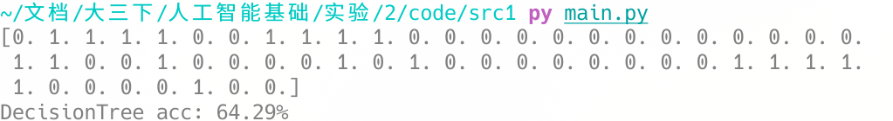
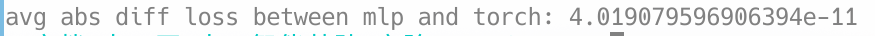

## 人工智能基础 实验二

甘文迪 PB19030801

### 1 决策树

决策树的运行结果为



用 `Node` 表示树的结点。`feature=None` 时表示是叶子结点，否则是非叶结点的划分属性的下标；字典 `children` 表示属性的不同值对应的子结点；`leafValue` 表示在这个结点上应给出怎样的预测值

```python
class Node:
    def __init__(self):
        self.feature = None
        self.children = {}
        self.leafValue = None
```

按每一种属性进行划分，计算划分后的信息熵，找到使得信息增益最大的属性，认为这是最优的划分属性

```python
    def chooseBestAttributeIndex(self, train_features, train_labels):
        trainCount = train_features.shape[0]
        attributeCount = train_features.shape[1]

        bestInfoGain = 0
        bestAttributeIndex = 0
        initEntropy = self.calculateEntropy(train_labels)

        for i in range(attributeCount):
            if self.valid[i] == False:
                continue

            # 划分属性值的范围
            split = self.splitDataset(train_features, i)

            # 计算信息增益
            entropy = 0
            for key, value in split.items():
                entropy += len(value) / trainCount * self.calculateEntropy(value[:, i])

            infoGain = initEntropy - entropy
            if infoGain > bestInfoGain:
                bestInfoGain = infoGain
                bestAttributeIndex = i
        return bestAttributeIndex
```

叶子结点的生成只需要设置 `leafValue`

```python
        node.leafValue = np.argmax(np.bincount(train_labels))

        if np.all(train_labels == train_labels[0]):
            return node
        if not (True in self.valid) or len(np.unique(train_labels)) == 1:
            return node
```

中间结点的生成要找到 `node.feature`，递归生成子结点并设置 `node.children`

```python
        bestAttributeIndex = self.chooseBestAttributeIndex(train_features, train_labels)
        node.feature = bestAttributeIndex

        # 划分属性值的范围
        split = self.splitDataset(combinedData, bestAttributeIndex)

        for key, value in split.items():
            # 递归生成子结点
            childNode = self.generateTree(value)
            node.children[key] = childNode
```

### 2 支持向量机

软间隔支持向量机

需要求解

$$
\max{\sum_i \alpha_i y_i} - \frac{1}{2} \sum_{i,j} \alpha_i y_i \alpha_j y_j K(\mathbf{x_i}, \mathbf{x_j})
$$

其中，$\alpha_i$ 满足约束条件

$$
0 \leq \alpha_i \leq C \\
\sum_{i} \alpha_i \cdot y_i = 0
$$

对应的代码为

```python
alpha = cvxpy.Variable(trainCount)

P = (y @ y.T) * self.KERNEL(x, x.T)
objective = cvxpy.Maximize(cvxpy.sum(alpha) * 2 - cvxpy.quad_form(alpha, P))

constraints = [alpha >= 0, alpha <= self.C, alpha @ train_label == 0]

problem = cvxpy.Problem(objective, constraints)
problem.solve(solver='ECOS')
```

然后计算 $\mathbf{w}, b$

$$
\mathbf{w} = \sum_{i} \alpha_i y_i \mathbf{x_i} \\
b = y_i - \mathbf{w} \mathbf{x_i}, \alpha_i = 0
$$

预测测试集上的结果，正确率约为 80%


在这个例子中，选择不同核函数对正确率影响不明显。通过观察发现，相较于 `Linear` 核函数，`Poly` 核函数倾向于预测为 1；相较于 `Poly` 核函数，`Gauss` 核函数更倾向于预测为 1。

### 3 手写感知机模型并进行反向传播

前向传播的公式为

$$
\begin{aligned}
    \mathbf{h_1} &= s_1(\mathbf{W_1} \mathbf{x} + \mathbf{b_1}) \\
    \mathbf{h_2} &= s_2(\mathbf{W_2} \mathbf{h_1} + \mathbf{b_2}) \\
    \mathbf{h_3} &= s_3(\mathbf{W_3} \mathbf{h_2} + \mathbf{b_3}) \\
    \mathbf{\hat{y}} &= s_4(\mathbf{W_4} \mathbf{h_3} + \mathbf{b_4}) \\
    l(y, \mathbf{\hat{y}}) &= -\log(\hat{y_t})
\end{aligned}
$$

$$
s_1 = s_2 = s_3 = \tanh \\
s_4 = softmax
$$

反向传播

$$
\begin{aligned}
    \frac{\partial L}{\partial \mathbf{b_4}} &= l's' = y - label &&
    \frac{\partial L}{\partial \mathbf{W_4}} &= \frac{\partial L}{\partial \mathbf{b_4}} \mathbf{h_3}^T \\
    \frac{\partial L}{\partial \mathbf{b_3}} &= \mathbf{W_4}^T \frac{\partial L}{\partial \mathbf{b_4}} * s_3' &&
    \frac{\partial L}{\partial \mathbf{W_3}} &= \frac{\partial L}{\partial \mathbf{b_3}} \mathbf{h_2}^T \\
    \frac{\partial L}{\partial \mathbf{b_2}} &= \mathbf{W_3}^T \frac{\partial L}{\partial \mathbf{b_3}} * s_2' &&
    \frac{\partial L}{\partial \mathbf{W_2}} &= \frac{\partial L}{\partial \mathbf{b_2}} \mathbf{h_1}^T \\
    \frac{\partial L}{\partial \mathbf{b_1}} &= \mathbf{W_2}^T \frac{\partial L}{\partial \mathbf{b_2}} * s_1' &&
    \frac{\partial L}{\partial \mathbf{W_1}} &= \frac{\partial L}{\partial \mathbf{b_1}} \mathbf{x}^T \\
\end{aligned}
$$

$$
s_1' = s_2' = s_3' = 1 - \tanh^2
$$

梯度下降

$$
\begin{aligned}
\mathbf{W_i} &= \mathbf{W_i} - \eta \frac{\partial L}{\partial \mathbf{W_i}} \\
\mathbf{b_i} &= \mathbf{b_i} - \eta \frac{\partial L}{\partial \mathbf{b_i}}
\end{aligned}
$$

设 `batchSize` 为 1

训练 100 轮，可以达到 97% 的正确率


loss 训练曲线如下。随着训练次数的增加，loss 逐渐减小


与 pytorch 自动求导、`SGD` 梯度下降相比较，差异很小，如下图所示。求导、反向传播的过程没有问题



最终部分 $\mathbf{W_i}$ 和 $\mathbf{b_i}$ 的结果为


#### 4 卷积神经网络

| layers | 描述         |
| ------ | ------------ |
| 1      | 2D 卷积 16,5 |
| 2      | 最大池化     |
| 3      | 2D 卷积 32,5 |
| 4      | 最大池化     |
| 5      | 线性层 120   |
| 6      | 线性层 84    |
| 7      | 线性层 10    |

> 使用 tanh 作为激活函数

前向传播的代码如下

```python
def forward(self, x):
    x = self.pool1(F.relu(self.conv1(x)))
    x = self.pool2(F.relu(self.conv2(x)))
    x = x.view(-1, 800)
    x = F.relu(self.linear1(x))
    x = F.relu(self.linear2(x))
    x = self.linear3(x)
    return x
```

使用 Adam 梯度下降

训练结果


训练 5 轮后正确率为 61%，训练更多轮可以达到更高
