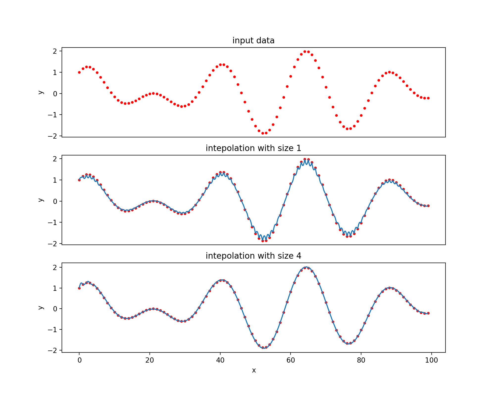
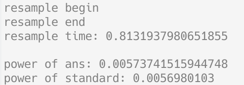

## 多媒体技术与应用 实验一

音频重采样

### 实验目的

学习音频重采样的原理，并给出实现

### 实验步骤

1. 获取原始音频数据
2. 对原始音频数据进行重采样

### 实验过程

#### 获取音频数据

若音频文件格式为 `mp3`，用 `ffmpeg` 转化为 `wav`

使用 `python` 的 `librosa`, `soundfile` 库读取 `wav` 文件的数据

#### 重采样方案调查

> [Sample-rate conversion - Wikipedia](https://en.wikipedia.org/wiki/Sample-rate_conversion) 中罗列了重采样的常见方式：

1. 如果两个采样率的比率为（或可近似为）一个固定的有理数 L/M：在每 L 个原始样本之间以两个速率中较低速率的一半对该信号进行低通滤波。选择 M 个样本，获得结果。
2. 将样本视为几何点，并通过插值创建任何需要的新点。选择插值方法是实现复杂性和转换质量（根据应用要求）之间的权衡。常用的有：ZOH（用于电影/视频帧）、cubic（用于图像处理）和加窗 sinc 函数（用于音频）。

决定使用 sinc 插值

#### sinc 插值

> 参考 [sinc 插值 实现](https://zhuanlan.zhihu.com/p/453094282)，[Whittaker–Shannon interpolation formula - Wikipedia](https://en.wikipedia.org/wiki/Whittaker%E2%80%93Shannon_interpolation_formula)

公式

$$
x(t)=\sum _{{n=-\infty }}^{{\infty }}x[n]\,{{\rm {sinc}}}\left({\frac {t-nT} {T}}\right)
$$

$d=\frac tT$ 是需要计算插值值的位置

对于非边缘值，使用 $\sum\limits_{{n=-size }}^{{size }}$ 来估计无穷级数

```python
def sincIntepolation(rawData, d, size=3):
    sum = 0
    left = max(0, floor(d) - size)
    right = min(len(rawData), ceil(d) + size + 1)

    for i in range(left, right):
        sum += rawData[i] * np.sinc(d - i)
    return sum
```



上图中

- 第一张图显示待插值的数据
- 第二张图显示 size=1 时的插值函数，注意到函数存在很多毛刺
- 第三张图显示 size=4 时的插值函数，此时插值函数较为光滑，但在边缘处拟合不太好

<br>

根据音频采样率 `sampleRate` 和目标采样率 `newSampleRate` 计算需要插值的点的位置，分别对这些点进行 sinc 插值

```python
def resample(rawData, sampleRate, newSampleRate):
    newLength = np.floor(len(rawData) / sampleRate * newSampleRate)
    allPosition = np.arange(newLength) / newSampleRate * sampleRate
    ans = np.array([sincIntepolation(rawData, i) for i in allPosition])
    return ans
```

### 实验结果

准备音频文件 `bach-musical-offering-crab-canon.wav` （巴赫 BWV1079 螃蟹卡农，来源：[flutetunes](https://www.flutetunes.com/tunes/bach-musical-offering-crab-canon.mp3)）

将其从 44100Hz 重采样至 20000Hz



与使用库函数 `librosa.resample(res_type='sinc_best')` 得到的音频功率相近

产生的音频导出后和原音频在听觉上没有明显差别

### 实验总结

sinc 插值是一种简明的重采样方法，可以用于时间序列的插值，是音频重采样的常用方法
