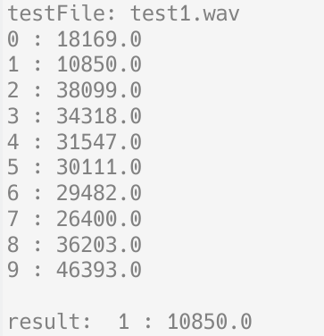
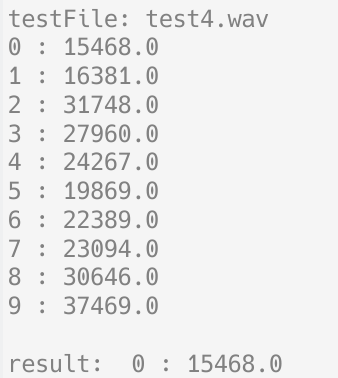

## 多媒体技术与应用 实验五

用时间规整方法检索出两段相近的语音

### 实验目的

了解语音模板匹配中的动态时间规整（DTW，Dynamic Time Warping）方法，重点掌握

+ 语音的矢量量化方法
+ DTW中的动态规划算法设计技巧

### 实验内容及要求

1. 模板库制作：准备数字0-9标准的语音样本库（单声道，采样率 6000Hz）
2. 采集数字 1 和 2 的语音波形，用于检索
3. 将库中 0-9 语音、检索音进行矢量量化
4. 用 DTW 算法进行孤立语音检索（匹配）

### 实验过程

量化样本库数据、检索音，对每个样本用 DTW 算法计算与检索音的差异，并输出最小差异对应的样本序号。

#### 量化

对采样后的数据连续两个作差，对变化的幅度进行求 `arctan`，将结果作线性变换，将 $\frac{\pi}2$, $-\frac{\pi}2$ 分别映射为 63, 0

```python
def dateToMark(data):
    diff = np.diff(data)
    angle = np.arctan(diff * 20)

    # pi/2 to 63, -pi/2 to 0
    angleMark = ((angle + np.pi / 2) / np.pi * 64).astype(int)
    return angleMark
```

#### DTW 算法

使用动态规划计算时间序列的相似性

> 参考 [Dynamic time warping - Wikipedia](https://en.wikipedia.org/wiki/Dynamic_time_warping)

```python
def dtw(x, y):
    m = len(x)
    n = len(y)

    d = np.zeros((m + 1, n + 1))
    for i in range(m + 1):
        for j in range(n + 1):
            d[i, j] = abs(x[i - 1] - y[j - 1])

    DTW = np.inf * np.ones((m + 1, n + 1))
    DTW[0, 0] = 0
    for i in range(1, m + 1):
        for j in range(1, n + 1):
            cost = d[i, j]
            DTW[i, j] = cost + min(DTW[i - 1, j], DTW[i, j - 1], DTW[i - 1, j - 1])
    return DTW[m, n]
```

### 实验结果

测试 1 的音频，结果为 1，结果正确



测试 4 的音频，结果错误。可能是因为样本中的 4 与检索音的音调差异较大。



### 实验结论

DTW 方法是简单易行的匹配算法；但也有其局限性，例如，样本与检索音差异较大时容易识别出错，样本数多时较慢。

### 备注

部分音频素材来源：[站长素材](https://sc.chinaz.com/yinxiao/150721136190.htm)
