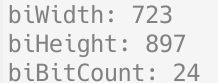
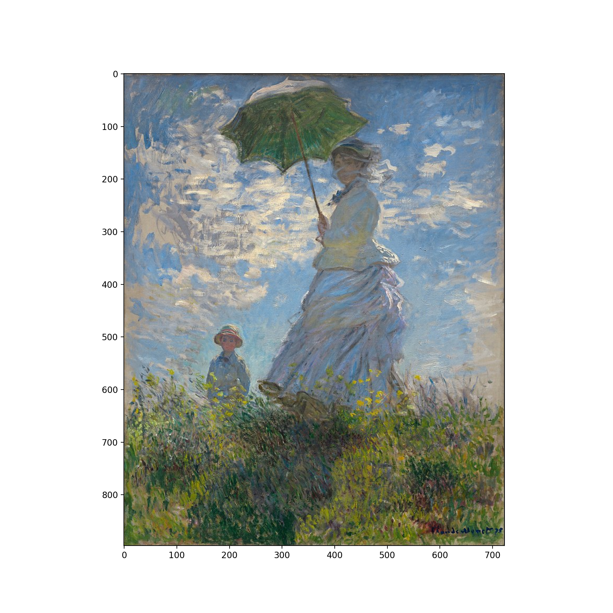
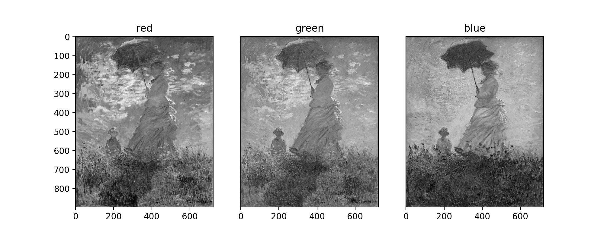

## 多媒体技术与应用 实验六

图像编码方法

### 实验目的

> 由于 16 色位图现实中较不常见，使用 24 位或 32 位 BMP 位图代替

以 24 位或 32 位 BMP 位图为例，了解位图文件的格式。

### 实验内容及要求

1. 准备一个 16 色位图文件
2. 研读文件格式
3. 参考位图文件数据结构
4. 设计程序，读出位图信息

### 实验过程

> 参考 [使用 C++ 读取简单的 24、32 位 BMP 图像 taoky](https://blog.taoky.moe/2017-02-06/read-bmp-with-cpp.html)，[BMP - 维基百科](https://zh.wikipedia.org/wiki/BMP)

#### 读取位图文件头

```python
    bfType = raw[0:2]  # 2
    bfSize = raw[2:6]  # 4
    bfReserved1 = raw[6:8]  # 2
    bfReserved2 = raw[8:10]  # 2
    bfOffBits = raw[10:14]  # 4
```

|    名称     |         说明         |
| :---------: | :------------------: |
|  `bfType`   |  BMP 文件中为 `BM`   |
| `bfOffBits` | 位图像素内容的偏移量 |

BMP 文件的 `bfType` 为 `BM`

```python
    if bfType != b'BM':
        exit('Not a BMP file')
```

将 `bfOffBits` 转换为整数，注意文件头中的整数以小端序存放

```python
    bfOffBits = int.from_bytes(bfOffBits, 'little')
```

#### 读取位图信息头

```python
    biSize = raw[14:18]  # 4
    biWidth = raw[18:22]  # 4
    biHeight = raw[22:26]  # 4
    biPlanes = raw[26:28]  # 2
    biBitCount = raw[28:30]  # 2
    biCompression = raw[30:34]  # 4
    biSizeImage = raw[34:38]  # 4
    biXPelsPerMeter = raw[38:42]  # 4
    biYPelsPerMeter = raw[42:46]  # 4
    biClrUsed = raw[46:50]  # 4
    biClrImportant = raw[50:54]  # 4
```

后续要用到下列值，也将它们转换为整数

|      名称       |              描述              |
| :-------------: | :----------------------------: |
|    `biWidth`    |    图像的宽度，以像素为单位    |
|   `biHeight`    |    图像的高度，以像素为单位    |
| `biCompression` | BMP 文件的压缩种类，0 为无压缩 |
|  `biBitCount`   |         每个像素的位数         |

仅考虑无压缩、24 或 32 位的位图

```python
    if biBitCount not in [24, 32]:
        exit('Only support 24 and 32 bit image')
    if biCompression != 0:
        exit('Only support uncompressed image')
```

#### 读取像素内容

+ 对于 32 色位图，按照蓝、绿、红、Alpha 值的顺序读取每个像素各通道内容。
+ 对于 24 色位图，按照蓝、绿、红的顺序读取每个像素各通道内容。图像每行的字节数应为 4 字节的倍数，不足的需要补齐。

```python
    data = np.zeros((height, width, colorBit), dtype=np.uint8)
    dataIndex = 0

    # 24 色位图
    if colorBit == 3:
        for i in range(height):
            for j in range(width):
                data[i, j, 2] = int.from_bytes(rawData[dataIndex:dataIndex + 1], 'little')  # blue
                data[i, j, 1] = int.from_bytes(rawData[dataIndex + 1:dataIndex + 2], 'little')  # green
                data[i, j, 0] = int.from_bytes(rawData[dataIndex + 2:dataIndex + 3], 'little')  # red
                dataIndex += 3
            # 4 字节对齐
            dataIndex += (4 - (width * 3) % 4) % 4
```

注意图像高度为负时，像素内容以从左到右、从上到下的格式存储；而正数值表示像素内容从左到右、从下到上读取。即图像高度大于 0 时，需要对读取的图像上下翻转

```python
    if biHeight > 0:
        data = np.flip(data, 0)
```

#### 实验结果

使用的图像是莫奈的 [《打阳伞的女人》](https://zh.wikipedia.org/wiki/%E6%89%93%E9%98%B3%E4%BC%9E%E7%9A%84%E5%A5%B3%E4%BA%BA)，先用 GIMP 导出为 BMP 格式的图像

再用程序读取位图信息



用 `matplotlib` 绘制程序读取的像素内容



三个通道的图像



+ 背景是蓝天白云，它们在蓝色通道下均较浅
+ 伞内部是绿色的，所以在绿色通道下颜色较浅

### 实验总结

了解位图文件的数据格式，尝试根据文件格式读取信息
