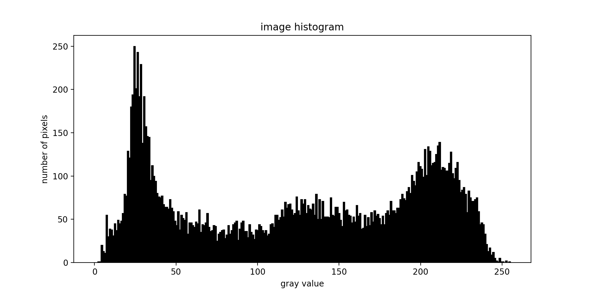
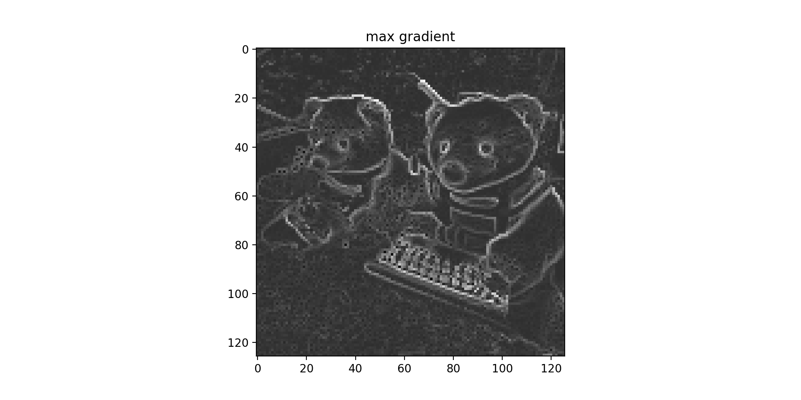
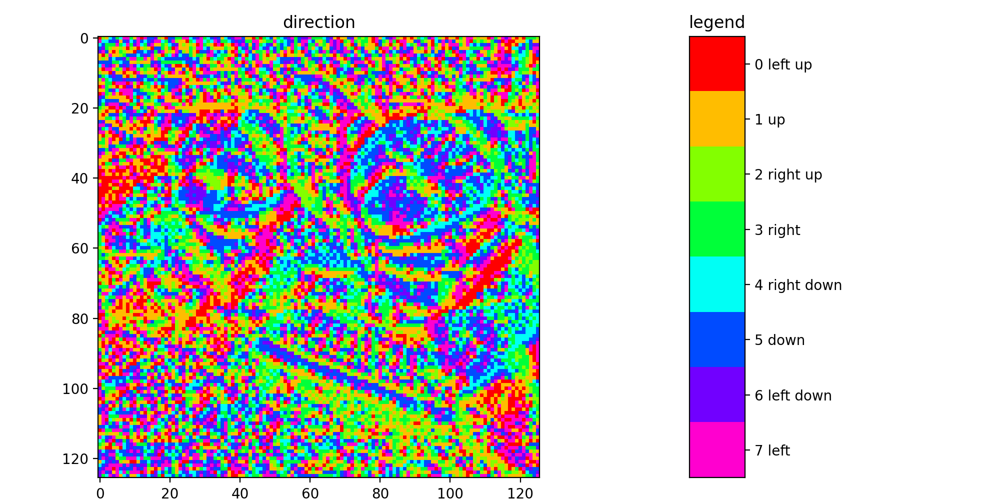
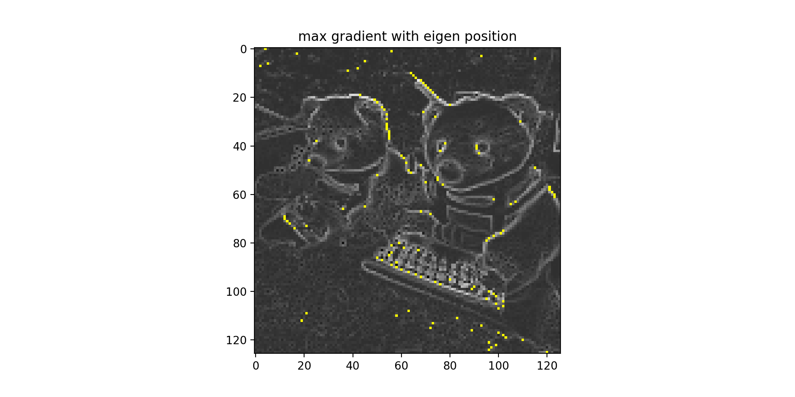
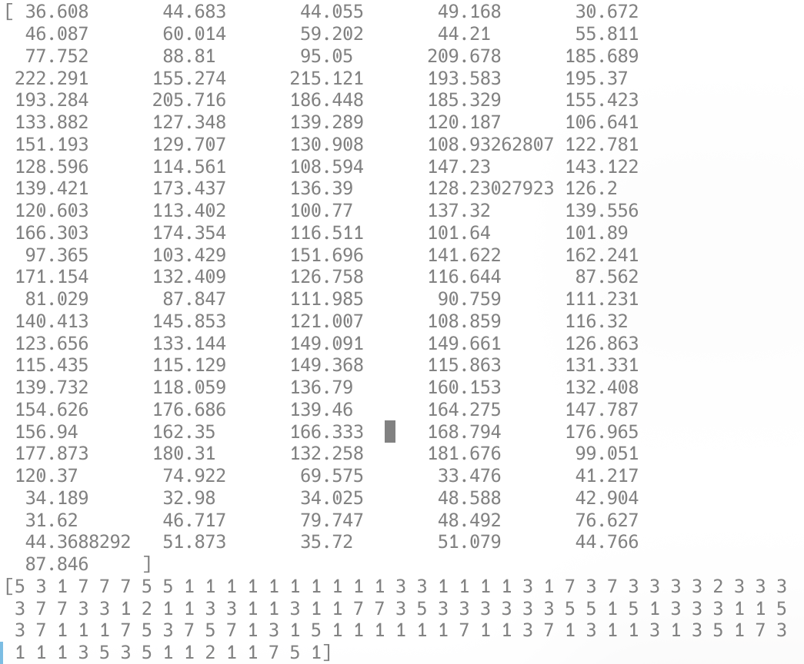

## 多媒体技术与应用 实验八

图像特征提取方法

### 实验目的

了解图像特征提取方法

### 实验步骤

1. 准备一幅 256 色位图
2. 将该图变换成 256 级灰度图
3. 求出该图像的灰度直方图
4. 取某像素为中心的 3*3 图像块，计算该像素的最大灰度梯度下降方向（8 向中的梯度最大者）；据此，依次顺序求取全图像各像素的最大灰度下降方向
5. 选择行的最大梯度方向与值，形成一个关于图像灰度的特征向量

### 实验过程

#### 图像预处理

使用 `cv2.imread` 读取图像数据。
为便于处理，转换为 128*128 的图像

将该图变换成256级灰度图

```python
    r = rawData[:, :, 0]
    g = rawData[:, :, 1]
    b = rawData[:, :, 2]
    grayData = 0.299 * r + 0.587 * g + 0.114 * b
```

使用 `plt.hist` 绘制直方图

#### 最大灰度梯度

对不在边缘上的像素，计算它与八个方向的像素的灰度差距，求出最大梯度下降值以及对应的方向

```python
def getMaxGradDirection(grayData):
    rowCount, colCount = grayData.shape
    direction = np.zeros((rowCount - 2, colCount - 2), dtype=np.int32)
    maxGrad = np.zeros((rowCount - 2, colCount - 2))

    for i in range(1, rowCount - 1):
        for j in range(1, colCount - 1):
            allGrad = np.array([
                (grayData[i, j] - grayData[i - 1, j - 1]) / sqrt(2),
                 grayData[i, j] - grayData[i - 1, j],
                (grayData[i, j] - grayData[i - 1, j + 1]) / sqrt(2),
                 grayData[i, j] - grayData[i, j + 1],
                (grayData[i, j] - grayData[i + 1, j + 1]) / sqrt(2),
                 grayData[i, j] - grayData[i + 1, j],
                (grayData[i, j] - grayData[i + 1, j - 1]) / sqrt(2),
                 grayData[i, j] - grayData[i, j - 1]
            ])
            direction[i - 1, j - 1] = np.argmax(allGrad)
            maxGrad[i - 1, j - 1] = np.max(allGrad)
    return direction, maxGrad
```

#### 求特征向量

计算每行的的最大梯度值、方向和对应的位置

```python
    for i in range(gradRowCount):
        eigenGrad[i] = np.max(maxGrad[i])
        argMax = np.argmax(maxGrad[i])
        eigenDirection[i] = direction[i, argMax]
        eightPosition[i] = argMax
```

### 实验结果

准备图像（来源：[DALL·E 2](https://openai.com/dall-e-2/)）


灰度直方图



求梯度下降值。图像的边缘处梯度较大



将梯度下降方向染色



每行梯度最大值的位置



对应的梯度最大值和方向如下图所示



在对原图作低强度高斯模糊后（原图大小为 1024*1024，作半径为 9 的高斯模糊），大部分梯度最大值位置没有明显改变（79% 的位置与原来相应行的位置差距不超过 2）


### 实验总结

通过求梯度可以获得与图像边缘相关的信息

每行梯度最大值位置可以反应图片的一些特征
