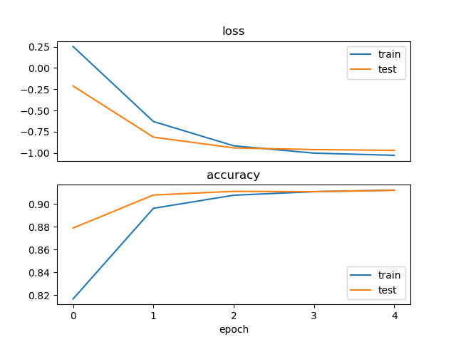

## <center>并行计算    实验四</center>

<center>甘文迪    PB19030801</center>

### 1. 问题描述

使用参数服务器(Parameter Server)架构训练一个机器学习模型，对 MNIST 手写数字图片进行分类。

> 自行选择参数服务器的同步模式。自行选择机器学习模型以及训练算法。使用 MPI 实现。可以使用 Python，可以使用 numpy 等基础数学库。不可使用 PyTorch、Tensorflow、Scikit-learn 等机器学习框架，不可使用 Horovord 等分布式机器学习框架。

### 2. 算法设计

#### 2.1 串行算法描述

网络结构：三个全连接层，中间用 `relu`，最后取 `logSoftmax`。使用 `nllloss` 函数与目标对比评估

```python
def forward(x: np.array):  # shape (784)
    global Ab1, r1, Ab2, r2, Ab3, y
    Ab1 = x @ A1 + b1      # shape (200)
    r1 = relu(Ab1)         # shape (200)
    Ab2 = r1 @ A2 + b2     # shape (50)
    r2 = relu(Ab2)         # shape (50)
    Ab3 = r2 @ A3 + b3     # shape (10)
    y = logSoftmax(Ab3)    # shape (10)
    return y
```

训练：对于每个图片，分别计算预测向量，反向传播得到梯度。每 `batchSize` 步使用 Adam 算法用平均梯度更新所有参数（`Ab1`, `r1`, `Ab2`, `r2`, `Ab3`, `y`）

执行训练、测试的次数为 `epochNumber`

> 串行部分代码见 [single.py](code/single.py)

#### 2.2 问题分析

反向传播需要较多的时间，所以将该部分并行

#### 2.3 并行算法描述

0. 一个进程作为 Server，其余进程作为 Worker
1. Server 初始化模型参数，发送给所有 Worker
2. 每个 Worker 随机读取一组图片，**计算预测向量，并反向传播得到梯度**
3. 所有 Worker 之间的梯度求平均
4. 将平均梯度发送给 Server，Server 使用该梯度更新模型参数
5. Server 将当前模型参数发送给所有 Worker，替换 Worker 上的模型参数
6. 重复步骤 2-5

> 并行部分代码见 [parallel.py](code/parallel.py)

### 3. 实验评测

#### 3.1 实验配置

##### 3.1.1 软硬件配置

+ CPU：Intel i5-9400
+ 内存：16GB
+ 操作系统：Debian bookworm/sid
+ Python: 3.10.4
+ mpirun: 4.1.4
+ numpy: 1.21.5

使用以下命令限制 numpy 可使用的线程数

```bash
export OMP_NUM_THREADS=1
```

然后运行

```bash
mpirun -n 3 python3 parallel.py
```

##### 3.1.2 数据集配置

使用 [MNIST 数据集](http://yann.lecun.com/exdb/mnist/)
读取使用 [MNIST-for-Numpy](https://github.com/hsjeong5/MNIST-for-Numpy)

#### 3.2 实验结果

##### 3.2.1 正确性验证

训练 5 轮后，串行算法的结果为 91%




结束训练后的识别效果如下，部分识别存在问题


> 串行算法正确率较低可能是因为参数设置不合理，也可能是算法实现部分存在问题

并行算法的正确率与串行算法接近


##### 3.2.2 加速比分析

| 处理器数 | 运行时间（秒） | 加速比  |
|:----:|:-------:|:----:|
| 串行   | 152.40  |      |
| 2    | 165.74  |      |
| 3    | 107.56  | 1.42 |

> 2 个处理器（1 个 Worker）的运行时间比串行时间长，是因为通信代价

加速效果并不理想，这可能和发送的数据较大、串行部分耗时较多有一定关系

改进方案：

+ 增大 `batchSize` 可以提高并行度，但可能影响准确性
+ Server 也可承担一部分的计算
+ 当 Server 与一个 Worker 通信时，之后的 Worker 可以执行一部分的计算，而非等待其通信

### 4 结论

学习了手动写神经网络中的一些算法（反向传播、Adam），了解如何对其进行训练、测试。

通过并行可以加速机器学习，但需要尽量减小通信成本、减小串行部分时间消耗。

### 6 参考

+ https://github.com/hsjeong5/MNIST-for-Numpy
