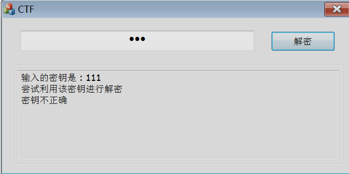
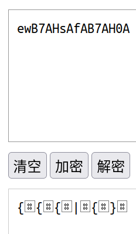

 

## <center>网络安全基础及应用-选做题解题报告</center>

<center>甘文迪	PB19030801</center>

### 环境

+ ubuntu 20.04.3
+ python 3.8.10
+ g++ 9.3.0
+ virtualbox 6.1.26
  + win7
  + IDA Pro 7.5
+ Vlab 实验中心
  + Intel Xeon Silver 4110 (2) @ 3.000GHz


### 1. 修复 `rar`

参考 [RAR 文件格式](https://blog.csdn.net/Claming_D/article/details/105899397)，使用软件 okteta，通过比对，发现 `MARK_HEAD` 残缺。
在头部添加十六进制的 `52617221`


打开文件并解压


### 2. 逆向

打开 happyreverse.exe，要求输入密钥（至多可输入 16 个字符），点击“解密”后程序判断是否正确




使用 PEiD 检测，没有检测出壳


#### 判断部分

使用 IDA Pro。通过字符串检测找到关键部分。


使用 F5 反编译，这部分调用了 `_wcsnicmp` 函数，参考 [Microsoft C 库函数](https://docs.microsoft.com/zh-cn/cpp/c-runtime-library/reference/strnicmp-wcsnicmp-mbsnicmp-strnicmp-l-wcsnicmp-l-mbsnicmp-l?view=msvc-170)，其作用是限定位数的不区分大小写的宽字符比较。若不考虑大小写的情况下 `v6` 的前 5 位是宽字符的 `flag{`，则输出 `v6`。

> 经过尝试，直接修改 exe 会输出乱码


#### RC4 部分

在主程序中，找到大量数据


数据部分的前一个函数中存在许多 `+` 和 `%256`，后一个函数中存在 `+` `^` 和 `%256`（如下图），怀疑是 RC4 加密


#### 前面的部分

##### base64

进行调试，当输入密码 `123` 时，输入 RC4 部分的 `v17` 为宽字节的 `ewB7AHsAfAB7AH0A`


输入其他的密码，末尾存在 `=`，认为是 base64 编码

| 输入的密码 |       `v17`        | 对 `v17` 作 base64 解密（宽字符） |
| :--------: | :----------------: | :-------------------------------: |
|    `1`     |     `ewB7AA==`     |               `{{`                |
|   `123`    | `ewB7AHsAfAB7AH0A` |             `{{{|{}`              |
|    `Ab`    |   `fAB7AH4AfAA=`   |              `|{~|`               |



##### 简易编码

猜想 base64 前对输入进行了简易的编码，即

```python
for i in password:
    high = i // 16
    low = i % 16
    simpleEncoded.append(0x78 + high)
    simpleEncoded.append(0)
    simpleEncoded.append(0x7a + low)
    simpleEncoded.append(0)
```


#### 调试

编写 `check.py`，模拟流程，然而发现

+ 得出的 `v6` 值不正确
+ 输入 `11` 和 `12` 会产生相同的 `v6`

设置断点调试，发现只访问了 base64 编码结果的一半

```python
base64ed = base64.b64encode(simpleEncoded)
ansBase64ed = base64ed[:len(base64ed) // 2]
```

经过多次验证，确认 `check.py` 逻辑正确


### 3. 枚举密钥

找到资料 [RC4密钥的暴力攻击实例 吾爱破解](https://www.52pojie.cn/thread-266903-1-1.html)，[RC4算法暴力破解的尝试 看雪论坛](https://bbs.pediy.com/thread-174969.htm)

后一篇文章文章中提供了较优的 RC4 计算程序，以及多线程的思路

编写 `crash.cpp`，枚举密钥的前几位

> 当计算结果前两位为宽字符的 `fl` 时，`crash.cpp` 会输出密钥，并输出匹配的字符位数


### 4. 运行结果

当枚举 6 位（对应密钥 12 位） ASCII 编码为 32-126 的字符时获得 flag

+ 密钥：前六位为 `VRRC4-`，后六位可以任取，例如 `VRRC4-123456`
+ flag：`flag{7bff50ab-8fdcb153-cea7aa6b-97a993d9}`
+ 运行时间：在双核 Xeon 4110 上，未完全运行使用了 114 小时；估计完全运行 6 位需要 125 小时


### 文件结构

- report.pdf		报告
- out.txt			未完全运行得到的结果
- src	
  - check.py		与 happyreverse.exe 逻辑相同的判断程序
  - rc4.py
  - crack.sh			编译 crack.cpp 并多进程执行
  - crack.cpp		枚举密钥
  - function.h


### 其他参考资料

+ [RC4 CTF Wiki](https://ctf-wiki.org/crypto/streamcipher/special/rc4/)
+ [Base 编码 CTF Wiki](https://ctf-wiki.org/misc/encode/computer/#base)
